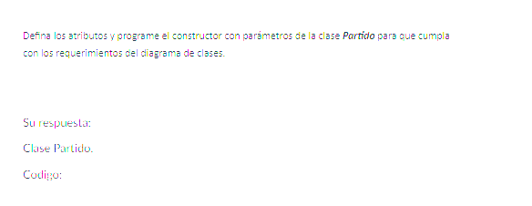
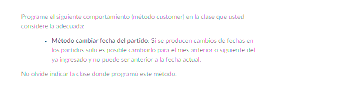
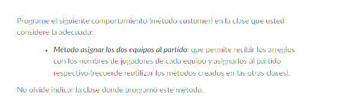
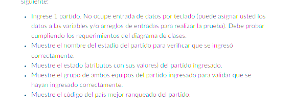
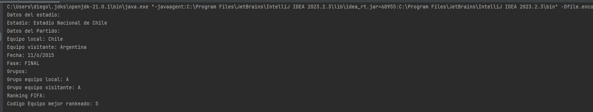
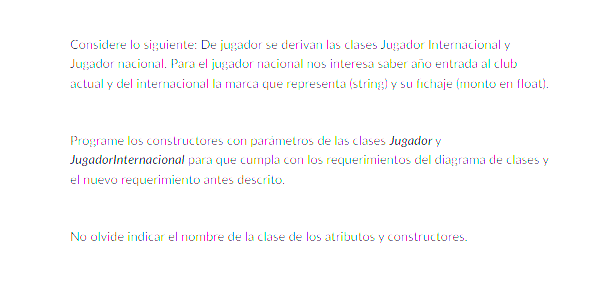
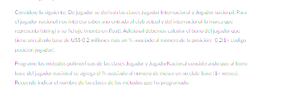
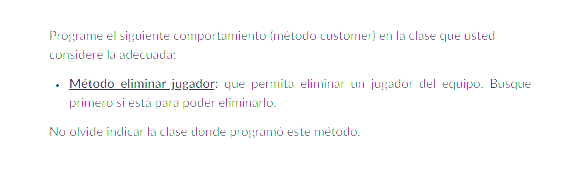
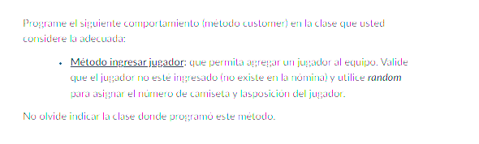
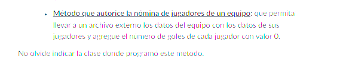

# Respuestas Restantes Solemne 1
## Pregunta 7 



```Java
//Clase Partido
 private Equipo equipoLocal;
    private Equipo equipoVisitante;
    private Fecha fecha;
    private Estadio estadio;
    private String  fase;

    public Partido(Equipo equipoLocal, Equipo equipoVisitante, Fecha fecha, Estadio estadio, String fase) {
        this.equipoLocal = equipoLocal;
        this.equipoVisitante = equipoVisitante;
        this.fecha = fecha;
        this.estadio = estadio;
        setFase(fase);
    }
```

## Pregunta 8


```Java
//Clase Partido
 public void cambiarFechaPartido( int nuevoDia, int nuevoMes, int nuevoAnio){
        LocalDate fechaActual = LocalDate.now();
        LocalDate nuevaFecha = LocalDate.of(nuevoAnio, nuevoMes, nuevoDia);
        LocalDate fechaPartidoActual = LocalDate.of(fecha.getAnio(), fecha.getMes(), fecha.getDia());

        if (nuevaFecha.isBefore(fechaActual)){
            throw new IllegalArgumentException("La fecha del partido no puede ser anterior a la fecha actual");
        }

        //comprobar que la nueva fecha sea para el mes anterio o siguiente del ya ingresado
        if((!nuevaFecha.isAfter(fechaPartidoActual.minusMonths(1)) && (!nuevaFecha.isBefore(fechaPartidoActual.plusMonths(1))))){
            throw new IllegalArgumentException("La fecha del partido debe ser para el mes anterior o siguiente del ya ingresado");
        }

        this.fecha.setDia(nuevoDia);
        this.fecha.setMes(nuevoMes);
        this.fecha.setAnio(nuevoAnio);
    }
```

## Pregunta 9


```Java
//Clase Partido
 public void asigarEquiposAlPartido(List<String> nombreJugadoresEquipoLocal, List<String> nombreJugadoresEquipoVisitante){
        this.equipoLocal.asignarJugadoresAlEquipo(nombreJugadoresEquipoLocal);
        this.equipoVisitante.asignarJugadoresAlEquipo(nombreJugadoresEquipoVisitante);
    }
//Clase Equipo
 public void asignarJugadoresAlEquipo(List<String> nombreJugadores) {
        Random random = new Random();
        List<Integer> numerosAsignados = jugadores.stream()
                .map(Jugador::getNumCamiseta)
                .collect(Collectors.toList());
        for (String nombreJugador : nombreJugadores) {
            int numCamiseta = generarNumeroCamisetaUnico(numerosAsignados);
            Posicion posicion = obtenerPosicionPredeterminada();
            //ya no se puede instanciar Jugador , debo instanciar las clases hijas
            //Se harán al azar con Random
            Jugador jugador;
            if (random.nextBoolean()) {
                int anioEntrada = random.nextInt(2023 - 2000) + 2000;
                jugador = new JugadorNacional(nombreJugador, numCamiseta, posicion, anioEntrada);
            } else {
                String marca = obtenerMarcaRepresentanteAleatoria();
                float fichaje = obtenerMontoFichajAleatorio();
                jugador = new JugadorInternacional(nombreJugador, numCamiseta, posicion, marca, fichaje);
            }

            this.jugadores.add(jugador);
            numerosAsignados.add(numCamiseta);
        }
    }

```

## Pregunta 10


```Java
//Clase PrincipalCopaAmerica
public class PrincipalCopaAmerica {
    public static void main(String[] args) {
        //Copa america 2015 Chile campeon ! :D
        Pais paisLocalChile = new Pais(40, "Chile");
        Pais paisVisitanteArgentina = new Pais(5, "Argentina");

        //Estadio
        Estadio estadioNacionalChile = new Estadio(1, "Estadio Nacional de Chile");

        //Equipos
        Equipo equipoLocalChile = new Equipo('A', 45, paisLocalChile);
        Equipo equipoVisitanteArgentina = new Equipo('A', 50, paisVisitanteArgentina);

        //Jugadores Chile
        List<String> jugadoresChile = List.of("Claudio Bravo", "Mauricio Isla", "Gary Medel", "Gonzalo Jara", "Eugenio Mena", "Charles Aranguiz", "Marcelo Diaz", "Arturo Vidal", "Alexis Sanchez", "Eduardo Vargas", "Jean Beausejour");
        //Jugadores Argentina
        List<String> jugadoresArgentina = List.of("Sergio Romero", "Pablo Zabaleta", "Ezequiel Garay", "Martín Demichelis", "Marcos Rojo", "Javier Mascherano", "Lucas Biglia", "Javier Pastore", "Lionel Messi", "Gonzalo Higuaín", "Ángel Di María");

        //Fehca Partido
        Fecha fechaPartido = new Fecha(11, 6, 2015);

        //Crear Partido
        Partido partido = new Partido(equipoLocalChile, equipoVisitanteArgentina, fechaPartido, estadioNacionalChile, "FINAL");

        //Asignar Equipos al partido
        partido.asigarEquiposAlPartido(jugadoresChile, jugadoresArgentina);

        System.out.println("Datos del estadio:");
        System.out.println("Estadio: " + partido.getEstadio().getNomEstadio());

        System.out.println("Datos del Partido:");
        System.out.println("Equipo local: " + partido.getEquipoLocal().getPais().getNomPais());
        System.out.println("Equipo visitante: " + partido.getEquipoVisitante().getPais().getNomPais());
        System.out.println("Fecha: " + partido.getFecha().getDia() + "/" + partido.getFecha().getMes() + "/" + partido.getFecha().getAnio());
        System.out.println("Fase: " + partido.getFase());


        System.out.println("Grupos:");
        System.out.println("Grupo equipo local: " + partido.getEquipoLocal().getGrupo());
        System.out.println("Grupo equipo visitante: " + partido.getEquipoVisitante().getGrupo());


        Equipo equipoMejorRankeado = partido.getEquipoLocal().getRankingFifa() > partido.getEquipoVisitante().getRankingFifa() ? partido.getEquipoLocal() : partido.getEquipoVisitante();

        System.out.println("Ranking FIFA:");
        System.out.println("Codigo Equipo mejor rankeado: " + equipoMejorRankeado.getPais().getCodPais());
    }


}
```
Imagen de la ejecución del programa


## Pregunta 11


```Java
//Clase Abstracta Jugador
public abstract class Jugador {
    private String nombre;
    private int numCamiseta;
    private Posicion posicion;

    public Jugador(String nombre, int numCamisera, Posicion posicion) {
        this.setNombre(nombre);
        this.setNumCamiseta(numCamisera);
        this.setPosicion(posicion);
    }

    public String getNombre() {
        return nombre;
    }

    public void setNombre(String nombre) {
        if (nombre == null || nombre.isEmpty()) {
            throw new IllegalArgumentException("El nombre no puede ser nulo o vacío");
        }
        this.nombre = nombre;
    }

    public int getNumCamiseta() {
        return numCamiseta;
    }

    public void setNumCamiseta(int numCamiseta) {
        if (
                (numCamiseta >= 0 && numCamiseta <= 15) ||
                (numCamiseta >= 20 && numCamiseta <= 25) ||
                (numCamiseta >= 30 && numCamiseta <= 35) ||
                (numCamiseta >= 40 && numCamiseta <= 45) ||
                (numCamiseta >= 50 && numCamiseta <= 55))
        {
            this.numCamiseta = numCamiseta;
        } else {
            throw new IllegalArgumentException("El número de camiseta debe estar entre 0 y 15, 20 y 25, 30 y 35, 40 y 45 o 50 y 55");
        }

    }

    public Posicion getPosicion() {
        return posicion;
    }

    public void setPosicion(Posicion posicion) {
        if (posicion == null) {
            throw new IllegalArgumentException("La posición no puede ser nula");
        }
        this.posicion = posicion;
    }

    public float calcularBono (){
        return 0.2f;
    }

    @Override
    public String toString() {
        return "Jugador{" +
                "nombre='" + nombre + '\'' +
                ", numCamiseta=" + numCamiseta +
                ", posicion=" + posicion +
                '}';
    }
}
```
```Java
//Clase JugadorNacional
   private int anioEntradaClubActual;

    public JugadorNacional(String nombre, int numCamisera, Posicion posicion, int anioEntradaClubActual) {
        super(nombre, numCamisera, posicion);
        this.anioEntradaClubActual = anioEntradaClubActual;
    }

    public int getAnioEntradaClubActual() {
        return anioEntradaClubActual;
    }

    public void setAnioEntradaClubActual(int anioEntradaClubActual) {
        this.anioEntradaClubActual = anioEntradaClubActual;
    }

//Clase Jugador Internacional 
  private String marca;
    private float fichaje;

    public JugadorInternacional(String nombre, int numCamisera, Posicion posicion, String marca, float fichaje) {
        super(nombre, numCamisera, posicion);
        this.marca = marca;
        this.fichaje = fichaje;
    }

```

## Pregunta 12


```Java
//Clase abstracta Jugador
public float calcularBono (){
        return 0.2f;
    }

//Clase Jugador Nacional 
@Override
    public float calcularBono (){
        float bonoBase = super.calcularBono();
        //vamos a suponer que se calcula con la fecha actual
        int anioActual = LocalDate.now().getYear();
        int meses = (anioActual - this.anioEntradaClubActual) * 12;
        return  bonoBase * (1+meses);
    }

//Clase Jugador Internacional
  @Override
    public float calcularBono (){
        float bonoBase = super.calcularBono();
        return  bonoBase * (1+this.getPosicion().getCodPos());
    }

```

## Pregunta 13


```Java
//Clase Equipo
 public void eliminarJugadorDelEquipo(String nombreJugador) {
        Iterator<Jugador> iterador = jugadores.iterator();
        while (iterador.hasNext()) {
            Jugador jugador = iterador.next();
            if (jugador.getNombre().equals(nombreJugador)) {
                iterador.remove();
                return;
            }
        }
        throw new IllegalArgumentException("No existe un jugador con ese nombre en el equipo");
    }
```

## Pregunta 14


```Java
//Clase Equipo
  public void agregarJugador(String nombreJugador) {
        for (Jugador jugador : jugadores) {
            if (jugador.getNombre().equals(nombreJugador)) {
                throw new IllegalArgumentException("Ya existe un jugador con ese nombre en el equipo");
            }
        }
        Random random = new Random();
        int numCamiseta = generarNumeroCamisetaUnico(jugadores.stream()
                .map(Jugador::getNumCamiseta)
                .collect(Collectors.toList()));
        Posicion posicion = obtenerPosicionPredeterminada();

        Jugador jugador;
        if (random.nextBoolean()) {
            int anioEntrada = random.nextInt(2023 - 2000) + 2000;
            jugador = new JugadorNacional(nombreJugador, numCamiseta, posicion, anioEntrada);
        } else {
            String marca = obtenerMarcaRepresentanteAleatoria();
            float fichaje = obtenerMontoFichajAleatorio();
            jugador = new JugadorInternacional(nombreJugador, numCamiseta, posicion, marca, fichaje);
        }

        this.jugadores.add(jugador);


    }
```

## Pregunta 15


```Java
//Clase Equipo
 public void autorizarNominaDeJugadores(String nombreArchivo) {
        try (PrintWriter writer = new PrintWriter(nombreArchivo)) {
            for (Jugador jugador : jugadores) {
                writer.println("Nombre: " + jugador.getNombre() +
                        ", Numero de camiseta: " + jugador.getNumCamiseta() +
                        ", Posicion: " + jugador.getPosicion().getNomPos() +
                        ", Goles: 0"
                );
            }
        } catch (Exception e) {
            throw new RuntimeException("Error al escribir el archivo", e);
        }
    }
```